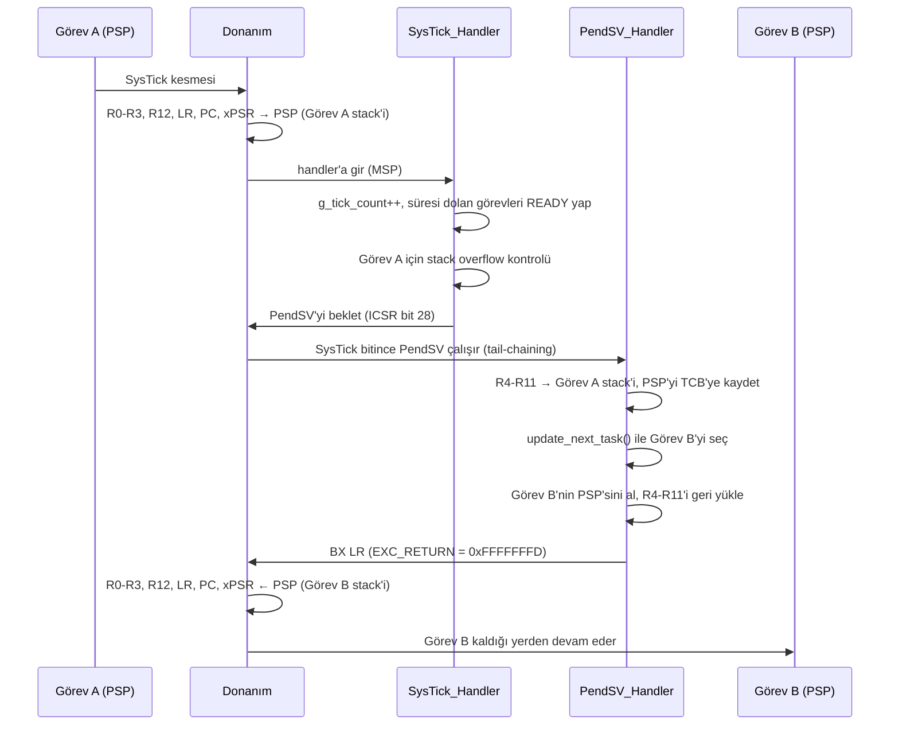

# Cortex M3 RTOS Kernel

## Proje Hakkında

ARM Cortex-M3 için sıfırdan yazılmış, eğitim amaçlı, minimal bir zaman dilimli (tick tabanlı), eşit öncelikli round-robin çekirdeğidir. Kernel, SysTick kesmesiyle belirlenen periyotlarda görevler arasında **Round-Robin** algoritmasıyla bağlam değiştirir (context switch).

### Amaç

RTOS kullanırken genelde bir kara kutu (black-box) olarak kalan iç yapıyı şeffaf hale getirmek ve şu sorulara kodla cevap vermek amaçlanmıştır:

- Bir görev nasıl oluşturulur ve stack'i nasıl hazırlanır?
- İşlemci bir görevden diğerine nasıl geçer?
- `delay` çağrıldığında görev nasıl uyutulur ve nasıl uyandırılır?
- Stack taşması nasıl tespit edilir?

### Temel Mekanizmalar

- **Task Control Block (TCB):** Her görevin PSP değeri, stack sınırı, durumu ve uyanacağı mutlak tick değeri tutulur.
- **Context Switch:** SysTick her tick'te PendSV'yi tetikler. PendSV, R4-R11 register'larını kaydedip bir sonraki görevin bağlamını yükler.
- **Görev Durumları:** Görevler `READY` veya `BLOCKED` durumunda olabilir.
- **Idle Task:** Çalışmaya hazır görev kalmadığında kernel'in kendi idle görevi çalışır.
- **Stack Overflow Tespiti:** Her görev stack'inin alt sınırına yakın bir yere (`tsk_stack_addr[16]`) bir canary değeri (`0xDEADBEEF`) yerleştirilir ve her context switch öncesinde kontrol edilir.

### Katmanlı Yapı

Kod, donanım bağımsızlığı için katmanlara ayrılmıştır. Böylece kernel farklı mimarilere port edilebilir:

| Katman | Klasör | Görevi |
|---|---|---|
| Uygulama | `app/` | Kullanıcı görevleri |
| Kernel | `middleware/` | Zamanlayıcı, TCB, gecikme yönetimi (büyük ölçüde mimariden bağımsız, bkz. [Tasarım Sınırlamaları](#tasarım-sınırlamaları)) |
| Port | `middleware/portable/arm_cm3/` | SysTick, PendSV, fault handler'lar (Cortex-M3'e özel) |
| BSP / Sürücü | `bsp/`, `drivers/` | Kart başlangıç kodu, linker script, LED sürücüsü |

Kernel, donanıma (bir istisna dışında, bkz. [Bilinen Sorunlar, KI-05](docs/KNOWN-ISSUES-TR.md#ki-05)) `port.h` arayüzü üzerinden erişir. Port katmanı ise kernel'i doğrudan tanımaz. Kernel fonksiyonlarını `sched_init()` sırasında **hook (callback)** olarak alır.

### Kapsam

| Kapsamda | Kapsam Dışı (şimdilik) |
|---|---|
| Round-Robin görev zamanlama | Görev öncelikleri (priority) |
| Context switch (SysTick + PendSV) | Mutex, semaphore |
| Tick tabanlı gecikme (`task_delay_*`) | Message queue, event group |
| Idle task | Dinamik bellek ile görev oluşturma |
| Stack overflow tespiti | Görev silme / askıya alma |

## Özellikler

- Round-Robin zamanlama algoritmasıyla görev değişimi.
- `task_delay_tick()` ve `task_delay_ms()` API'leriyle görevleri belirli sürelerce bloklama.
- Context switch sırasında stack overflow kontrolü.

## Hedef Donanım

- ARM Cortex-M3, STM32F103C8T6 "Blue Pill" (8 MHz HSI, PLL yapılandırılmıyor)
- Demo uygulaması için GPIOA'ya bağlı harici LED'ler (active-high: pin → LED → seri direnç → GND)

| Pin | LED | Kullanan görev (`app/main.c`) |
|---|---|---|
| PA0 | `LED_BLUE` | `task_led1` (500 tick) |
| PA1 | `LED_WHITE` | `task_led2` (250 tick) |
| PA2 | `LED_RED` | `task_led3` (1000 tick) |
| PA3 | `LED_GREEN` | Kullanılmıyor (sadece başlatılıyor) |

Kartın üzerindeki PC13 LED'i kullanılmaz. LED sürücüsündeki bilinen bir race condition için bkz. [Bilinen Sorunlar, KI-07](docs/KNOWN-ISSUES-TR.md#ki-07).

## Klasör Yapısı

```
cortex-m3-rtos-kernel-educational-project/
├── app/
│   └── main.c
├── bsp/
│   └── stm32f103c8t6/
│       ├── bsp_stm32f103c8t6.h
│       ├── stm32f103c8t6_linker_script.ld
│       └── stm32f103c8t6_startup.c
├── common/
│   ├── return_enum.h
│   └── scheduler_config.h
├── docs/
│   ├── KNOWN-ISSUES-TR.md
│   └── KNOWN-ISSUES.md
├── drivers/                      
│   ├── led.c
│   └── led.h
├── middleware/                   
│   ├── portable/                 
│   │   └── arm_cm3/
│   │       ├── port_asm.s
│   │       ├── port.c
│   │       └── port.h
│   ├── scheduler.c
│   ├── scheduler.h
│   └── scheduler_priv.h
├── .gitignore
├── LICENSE
├── Makefile
├── README-TR.md
└── README.md
```

## Derleme ve Yükleme

### Gereksinimler

- ARM GNU Toolchain (`arm-none-eabi-gcc`, `arm-none-eabi-objcopy`)
- GNU Make
- Yükleme için: OpenOCD ve ST-Link programlayıcı

STM32F103C8T6 için linker script ve startup dosyası `bsp/stm32f103c8t6/` altında hazırdır. Başka bir karta port ederken bu dosyaların o karta göre yazılması gerekir.

### Derleme

```
make          # build/final.elf ve build/final.bin üretir
make clean    # build/ klasörünü siler
```

> **Önemli:** Makefile header bağımlılıklarını takip etmez. Bir `.h` dosyasını (örn. `scheduler_config.h`) değiştirdikten sonra `make clean && make` çalıştırın. Aksi halde eski değerlerle derlenmiş nesne dosyaları kullanılır (bkz. [Bilinen Sorunlar, KI-11](docs/KNOWN-ISSUES-TR.md#ki-11)).

### Yükleme

```
openocd -f interface/stlink.cfg -f board/stm32f103c8_blue_pill.cfg -c "program build/final.elf verify reset exit"
```

`make load` hedefi şu an yalnızca OpenOCD sunucusunu başlatır (GDB ile bağlanıp debug yapmak için). Karta yükleme yapmaz.

## Konfigürasyon

`common/scheduler_config.h` içindeki makroların değerlerini uygulamanızın gereksinimlerine göre değiştirerek kernel'i yapılandırabilirsiniz. Değişiklikten sonra `make clean && make` çalıştırın (bkz. Derleme). Makrolar:

- `MAX_TASKS` programınızdaki toplam görev sayısıdır: kullanıcı görevleri + 1 (idle task). 3 görev için 4 yazılmalıdır. **Şu an tam olarak bu değere eşit olmalıdır.** Fazla verilirse boş slotlar zamanlayıcı tarafından seçilir (bkz. [Bilinen Sorunlar, KI-01](docs/KNOWN-ISSUES-TR.md#ki-01)).
- `TICK_HZ` SysTick zamanlayıcısının kesme frekansı (Hz). Varsayılan: 1000 (1 tick = 1 ms).
- `CONFIG_MAX_TICK_HZ` `TICK_HZ`'nin alabileceği en yüksek değer. Varsayılan: 5000. `TICK_HZ` bu değeri geçerse SysTick ayarlanmaz (bkz. [Bilinen Sorunlar, KI-02](docs/KNOWN-ISSUES-TR.md#ki-02)). Yüksek frekans gerekiyorsa, CPU'nun daha sık kesileceğini göz önünde bulundurun.
- `MIN_STACK_SIZE` Bir görevin alabileceği en küçük stack boyutu (word)[^1]. Varsayılan: 64 word. Idle task'ın stack'i `scheduler.c` içinde 128 word olarak sabittir ve bu makroyla değişmez. Bu yüzden `MIN_STACK_SIZE` **en fazla 128** olabilir. Aksi halde idle task eklenemez ve `sched_init()` `INVALID_PARAM` döner.

[^1]: Her görev stack'inin en alttaki 17 word'ü sabit olarak ayrılır: 16 word tampon + 1 word canary. Görev her kesildiğinde ise bağlamı için 16 word (donanım 8 + PendSV 8, hizalama dolgusuyla 17) gerekir. İlk context frame de bu alanı kullanır. Yani görevin kendi değişkenleri ve fonksiyon çağrıları için kalan alan yaklaşık `tsk_stack_size - 33` word'tür (varsayılan minimumda 64 - 33 = 31 word).

## Kullanım Örneği

> **Dikkat:** Bu örnek 2 görev eklediği için `common/scheduler_config.h` içinde `MAX_TASKS` değeri **3** (2 görev + idle) yapılmalıdır. Varsayılan değer (4) ile boş slot seçilir ve sistem çöker (bkz. [Bilinen Sorunlar, KI-01](docs/KNOWN-ISSUES-TR.md#ki-01)).

```C
#include "scheduler.h"
#include "bsp_stm32f103c8t6.h"
#include "led.h" // led driver header for demo

// NOTE: requires MAX_TASKS = 3 (2 tasks + idle) in scheduler_config.h

// Define task stacks (8-byte alignment recommended by AAPCS, see sched_add_task rules)
uint32_t task_red_led_stack[128] __attribute__((aligned(8)));
uint32_t task_blue_led_stack[128] __attribute__((aligned(8)));

void task_red_led_handler(void) {

    while(1) {
        led_on(LED_RED);
        task_delay_tick(1000);
        led_off(LED_RED);
        task_delay_tick(1000);
    }
}

void task_blue_led_handler(void) {
    while(1) {
        led_on(LED_BLUE);
        task_delay_tick(500);
        led_off(LED_BLUE);
        task_delay_tick(500);
    }
}

int main(void) {
    // 1. Initialize Kernel with CPU frequency
    // The kernel does not configure the clock. Pass the CPU frequency your device actually runs at.
    init_all_leds();
    sched_init(HSI_CLOCK);

    // 2. Add Tasks
    sched_add_task(task_red_led_handler, task_red_led_stack, 128);
    sched_add_task(task_blue_led_handler, task_blue_led_stack, 128);

    // 3. Start Scheduler
    sched_start();

    return 0; // Should never reach here
}

```


## API Kullanımı

Tüm genel API `middleware/scheduler.h` içinde tanımlıdır. Kernel API'sini kullanmak için bu header yeterlidir. Dönüş kodlarını içeren `return_enum.h` de bu header üzerinden gelir.

### Çağrı Sırası

```
sched_init()  →  sched_add_task() × N  →  sched_start()
                                            │
                     görevlerin içinden:    ├─ task_delay_tick()
                                            ├─ task_delay_ms()
                                            └─ sched_get_tick()
```

### Dönüş Kodları (`System_Status_t`)

`common/return_enum.h` içinde tanımlıdır:

| Kod | Değer | Anlamı |
|---|---|---|
| `OK` | 0 | İşlem başarılı |
| `ERROR_INIT` | 1 | Başlatma hatası (şu an hiçbir fonksiyon döndürmüyor) |
| `WARNING` | 2 | Uyarı (şu an kullanılmıyor) |
| `ERROR_STACK_OVERFLOW` | 3 | Stack taşması tespit edildi (yalnızca dahili. Taşmada sistem durduğu için hiçbir public API'den dönmez) |
| `INVALID_PARAM` | 4 | Geçersiz parametre |
| `REACHED_MAX_TASK` | 5 | `MAX_TASKS` sınırına ulaşıldı |

---

### `sched_init`

```c
System_Status_t sched_init(uint32_t clock_source);
```

Kernel'i başlatır. **Diğer tüm API'lerden önce çağrılmalıdır.** `sched_add_task()` bundan önce çağrılırsa ilk kullanıcı görevi 0. indekse yerleşir ve idle task gibi davranır: yalnızca başka hiçbir görev `READY` değilken çalışır ve içinden çağrılan `task_delay_*` gecikme yapmaz.

| Parametre | Açıklama |
|---|---|
| `clock_source` | İşlemci saat frekansı (Hz). Örn: `HSI_CLOCK` (8 MHz) veya `72000000` (yalnızca PLL'i kendiniz 72 MHz'e ayarladıysanız. Kernel saati ayarlamaz). `TICK_HZ` değerinden büyük olmalıdır (bkz. [Bilinen Sorunlar, KI-08](docs/KNOWN-ISSUES-TR.md#ki-08)). |

Bu fonksiyon sırasıyla şunları yapar:

1. Kernel fonksiyonlarını port katmanına hook olarak kaydeder.
2. UsageFault, BusFault ve MemManage fault'larını etkinleştirir.
3. SysTick'i `TICK_HZ` frekansında kesme üretecek şekilde ayarlar ve başlatır.
4. Idle task'ı oluşturur (görev indeksi 0).

| Dönüş | Durum |
|---|---|
| `OK` | Başarılı. **Dikkat:** SysTick ayarlanamasa bile `OK` döner (bkz. [Bilinen Sorunlar, KI-02](docs/KNOWN-ISSUES-TR.md#ki-02)) |
| `INVALID_PARAM` | `clock_source == 0` ya da `MIN_STACK_SIZE > 128` olduğu için idle task eklenemedi |
| `REACHED_MAX_TASK` | Görev tablosu dolu olduğu için idle task eklenemedi (örn. `sched_init()` ikinci kez ya da `sched_add_task()` çağrılarından sonra çağrıldı) |

> **Not:** Idle task da bir görev slotu kullanır. 3 kullanıcı görevi için `MAX_TASKS` 4 olmalıdır.
>
> **Not:** SysTick bu fonksiyonun içinde başlatılır, yani `sched_start()`'tan önce tick gelebilir (bkz. [Bilinen Sorunlar, KI-03](docs/KNOWN-ISSUES-TR.md#ki-03)).

---

### `sched_add_task`

```c
System_Status_t sched_add_task(void (*task_handler)(void),
                               uint32_t *tsk_stack_addr,
                               uint16_t tsk_stack_size);
```

Yeni bir görev oluşturur ve `READY` durumunda zamanlayıcıya ekler. Görevin stack'ine canary değeri ve ilk context frame'i (16 word) yazılır.

| Parametre | Açıklama |
|---|---|
| `task_handler` | Görev fonksiyonu. `void f(void)` imzasında olmalıdır. |
| `tsk_stack_addr` | Görev için ayrılmış `uint32_t` dizisinin **başlangıç** adresi. |
| `tsk_stack_size` | Stack boyutu, **word cinsinden** (byte değil). En az `MIN_STACK_SIZE`. |

| Dönüş | Durum |
|---|---|
| `OK` | Görev eklendi |
| `INVALID_PARAM` | `task_handler` veya `tsk_stack_addr` `NULL`, ya da `tsk_stack_size < MIN_STACK_SIZE` |
| `REACHED_MAX_TASK` | Görev tablosu dolu |

**Kurallar:**

- Görev fonksiyonu **asla return etmemelidir**. Gövdesi sonsuz bir `while(1)` döngüsü olmalıdır.
- Stack dizisi `static` veya global olmalıdır. Yerel (fonksiyon içi) bir dizi kullanılmamalıdır.
- Stack dizisinin 8 byte hizalı olması önerilir (AAPCS): `__attribute__((aligned(8)))`. Görev stack'in tepesinden (`tsk_stack_addr + tsk_stack_size`) başladığı için `tsk_stack_size`'ın da çift sayı olması gerekir. Kernel hizalamayı kontrol etmez ve düzeltmez (bkz. [Bilinen Sorunlar, KI-06](docs/KNOWN-ISSUES-TR.md#ki-06)).
- `sched_init()`'ten önce çağrılmamalıdır (bkz. `sched_init`).
- `sched_start()` çağrıldıktan sonra görev eklenmemelidir.

```c
static uint32_t stack_task_led[128] __attribute__((aligned(8)));

if (sched_add_task(&task_led, &stack_task_led[0], 128) != OK)
{
    // hata yönetimi
}
```

---

### `sched_start`

```c
void sched_start(void);
```

Zamanlayıcıyı başlatır. **Geri dönmez.**

Thread mode'un stack pointer'ını MSP'den PSP'ye geçirir ve ilk olarak idle task'ı çalıştırır. Idle task exception dönüşüyle değil, **doğrudan bir fonksiyon çağrısıyla** başlatılır. Bu yüzden idle task'ın sahte context frame'i hiç kullanılmaz. İlk SysTick kesmesinde context switch yapılır ve `READY` durumdaki kullanıcı görevleri sırayla çalışmaya başlar.

MSP, `main()` ve `sched_start()`'ın kullandığı derinlikte kalır ve `_estack`'e geri alınmaz.

---

### `task_delay_tick`

```c
void task_delay_tick(uint32_t tick_count);
```

Çağıran görevi `BLOCKED` durumuna alır ve hemen başka bir göreve geçer. Gecikme n-1 ile n tick arasındadır (tick'in ortasında çağrılırsa kısalır). Görevin Round-Robin'de sırasını beklerken geçirdiği süre buna eklenebilir. Süre dolduğunda SysTick handler görevi tekrar `READY` yapar.

| Parametre | Açıklama |
|---|---|
| `tick_count` | Beklenecek tick sayısı. 1 tick = `1 / TICK_HZ` saniye. |

- **Sadece görev içinden çağrılmalıdır.** Idle task içinden veya `sched_start()` öncesinde çağrılırsa gecikme yapmaz ama kesmeleri açar.
- **Kesme handler'ı (ISR) içinden çağrılmamalıdır.** Çağrılırsa o an kesilmiş olan görevi bloklar ve kesmeleri ISR'nin ortasında açar.
- `tick_count = 0` verilirse görev bir sonraki tick'e kadar CPU'yu bırakır (yield).
- Çok büyük `tick_count` değerleri ya da tick sayacının taşmasına yakın çağrılar gecikmenin erken bitmesine yol açabilir (bkz. [Bilinen Sorunlar, KI-04](docs/KNOWN-ISSUES-TR.md#ki-04)).
- Fonksiyon kritik bölge için kesmeleri kapatıp açar. Çıkışta kesmeler **her zaman** açılır.

```c
task_delay_tick(500);   // TICK_HZ = 1000 ise 500 ms
```

---

### `task_delay_ms`

```c
void task_delay_ms(uint32_t ms);
```

Gecikmeyi milisaniye cinsinden verir. Kendi içinde tick'e çevirip `task_delay_tick()` çağırır:

```c
tick = (ms * TICK_HZ) / 1000
```

- Sonuç tamsayı bölmesiyle **aşağı yuvarlanır**. Örn: `TICK_HZ = 100` iken `task_delay_ms(5)` → 0 tick.
- Çok büyük `ms` değerlerinde `ms * TICK_HZ` çarpımı taşabilir (`TICK_HZ = 1000` için ~4 294 967 ms ≈ 71 dk üstü).

```c
task_delay_ms(250);
```

---

### `sched_get_tick`

```c
uint32_t sched_get_tick(void);
```

Kernel başlatıldığından beri geçen toplam tick sayısını döndürür. Zaman ölçümü için kullanılabilir:

```c
uint32_t start = sched_get_tick();
/* ... iş ... */
uint32_t elapsed_ticks = sched_get_tick() - start;
```

> **Not:** Sayaç 32 bittir. `TICK_HZ = 1000` iken yaklaşık **49,7 günde** taşar ve sıfırdan başlar. Yukarıdaki gibi işaretsiz çıkarma yapılırsa ölçüm taşmadan etkilenmez.

---

### `init_idle_task` (dahili)

```c
System_Status_t init_idle_task(void);
```

`scheduler.h` içinde görünse de **kullanıcı tarafından çağrılmamalıdır**. `sched_init()` bu fonksiyonu zaten çağırır. Tekrar çağrılırsa ikinci bir idle task normal bir görev gibi tabloya eklenir. Bu da bir görev slotunu ve CPU zamanını boşa harcar.

## Mimari ve Çalışma Mantığı

### Görev Yapısı (TCB)

Her görev, `middleware/scheduler_priv.h` içindeki bir **Task Control Block** ile temsil edilir:

```c
typedef struct
{
  uintptr_t psp_value;          // Görevin son kaydedilen stack pointer'ı (PSP)
  uint32_t *stack_limit;        // Canary'nin adresi (stack'in güvenli alt sınırı)
  uint32_t  block_count;        // Görevin uyanacağı mutlak tick değeri
  uint8_t   current_state;      // TASK_READY_STATE (0x00) / TASK_BLOCKED_STATE (0xFF)
  void    (*task_handler)(void);// Görev fonksiyonu
} TCB_t;
```

TCB'ler statik bir dizide tutulur: `static TCB_t user_tasks[MAX_TASKS]`. Dinamik bellek kullanılmaz.

- **İndeks 0** her zaman idle task'a aittir (`sched_init()` içinde eklenir).
- **İndeks 1 … `MAX_TASKS-1`** kullanıcı görevleridir ve `sched_add_task()` çağrı sırasıyla doldurulur.
- `current_task` o an çalışan görevin indeksini tutar.

#### Görev Stack'inin İlk Hali

`sched_add_task()`, görev hiç çalışmamış olsa da sanki daha önce kesilmiş gibi sahte bir context frame hazırlar. Böylece kullanıcı görevlerinin ilk context switch'i, diğerlerinden farklı bir yol gerektirmez. Idle task bunun istisnasıdır: `sched_start()` onu doğrudan çağırdığı için sahte frame'i kullanılmaz.

```
yüksek adres  ┌────────────────────┐ ← tsk_stack_addr + tsk_stack_size
              │ xPSR = 0x01000000  │  Thumb biti (T=1). Cortex-M yalnızca Thumb çalıştırır.
              │ PC   = task_handler│  Exception dönüşünde buradan çalışmaya başlar.
              │ LR   = 0xFFFFFFFD  │  Görev return ederse geçersiz adrese dallanır → fault.
              │ R12, R3, R2, R1, R0│  = 0         ┐ donanımın otomatik kaydettiği
              ├────────────────────┤               ┘ 8 word
              │ R11 … R4           │  = 0         ← PendSV'nin yazılımla kaydettiği 8 word
              ├────────────────────┤ ← psp_value (ilk değer)
              │   (boş alan)       │  görevin kendi kullanımı
              │ 0xDEADBEEF         │ ← stack_limit = tsk_stack_addr[16]
              │ 16 word tampon     │
düşük adres   └────────────────────┘ ← tsk_stack_addr
```

### Bağlam Değiştirme (SysTick / PendSV / PSP)

Cortex-M3'te iki stack pointer vardır:

| Stack Pointer | Kullanan |
|---|---|
| **MSP** (Main SP) | Reset sonrası `main()`, tüm kesme ve exception handler'ları |
| **PSP** (Process SP) | `sched_start()` sonrası tüm görevler (her görevin kendi PSP değeri vardır) |

`sched_start()` içindeki `switch_sp_to_psp`, PSP'yi idle task'ın stack'ine ayarlar ve `CONTROL` register'ının 1. bitini set eder. Bu noktadan sonra thread mode PSP kullanır, handler'lar MSP kullanmaya devam eder. Böylece handler'ların kendi değişkenleri ve fonksiyon çağrıları görev stack'lerini tüketmez. Ancak bir görev kesildiğinde donanımın otomatik kaydettiği 8 word'lük frame (hizalama dolgusuyla 9) **görevin kendi stack'ine (PSP)** yazılır. Her görev stack'inde bunun için yer kalmalıdır.

Context switch iki aşamada gerçekleşir:



**Neden switch doğrudan SysTick içinde değil de PendSV'de yapılıyor?** Context switch isteği birden fazla yerden gelebilir: SysTick'ten, `task_delay_tick()`'ten veya ileride başka bir kesmeden. Switch, başka bir kesme yarıda kalmışken yapılırsa o kesmenin bağlamı bozulur. PendSV ise "şimdi beklet, uygun olunca çalıştır" mantığıyla çalışan bir exception'dır. En düşük önceliğe ayarlandığında, diğer tüm handler'lar bittikten sonra çalışması garanti olur. Bu yüzden her iki yol da aynı `port_trigger_context_switch()` fonksiyonuyla PendSV'yi bekletir ve switch tek bir yerde yapılır.

### Görev Seçimi (Round-Robin)

`update_next_task()`, `current_task`'tan başlayarak tabloyu dairesel olarak tarar:

```c
for (i = 0; i < MAX_TASKS; i++)
{
    current_task = (current_task + 1) % MAX_TASKS;
    if (state == READY && current_task != 0) break;   // idle hariç ilk READY görev
}
if (bulunamadı) current_task = 0;                     // hiçbiri hazır değilse idle
```

- Zaman dilimi (time slice) **1 tick**'tir. Her SysTick'te sıradaki READY göreve geçilir.
- Idle task, ancak **hiçbir kullanıcı görevi READY değilse** seçilir.
- Öncelik kavramı yoktur. Tüm READY görevler eşit pay alır.

Örnek (`main.c`, `TICK_HZ = 1000`). Görevler LED'i değiştirip hemen delay çağırdığı için tick beklemeden sıradaki göreve geçilir:

```
tick 0       : idle  (sched_start)
tick 1       : L1 → delay(500) → L2 → delay(250) → L3 → delay(1000) → idle
tick 2..250  : idle  (tüm görevler BLOCKED)
tick 251     : L2 uyanır → delay(250) → idle
tick 501     : L1 ve L2 uyanır → L1 → L2 → idle
...
```

### Zamanlama ve Gecikme

Gecikme mekanizması **mutlak uyanma zamanı** üzerine kuruludur:

1. Görev `task_delay_tick(n)` çağırır.
2. Kesmeler kapatılır. TCB'ye `block_count = g_tick_count + n` yazılır ve görev `BLOCKED` yapılır.
3. `schedule()` overflow kontrolü yapar ve PendSV'yi bekletir.
4. Kesmeler açılınca PendSV hemen çalışır ve görev CPU'yu bırakır.
5. Her SysTick'te `unblock_tasks()`, `block_count <= g_tick_count` olan görevleri tekrar `READY` yapar.
6. Görev, Round-Robin'de sırası geldiğinde `task_delay_tick()`'ten dönmüş gibi devam eder.

> Görev `READY` olduğu tick'te hemen çalışmayabilir. Önünde başka READY görevler varsa sırasını bekler. Gecikme n-1 ile n tick arasındadır (tick'in ortasında çağrılırsa kısalır). Görevin Round-Robin'de sırasını beklerken geçirdiği süre buna eklenebilir.

### Stack Overflow Kontrolü

Kontrol yazılımsaldır. `check_task_stack_overflow()` iki koşula bakar:

| Koşul | Anlamı |
|---|---|
| `*stack_limit != 0xDEADBEEF` | Canary üzerine yazılmış, stack taşmış |
| `stack_limit > psp_value` | TCB'de kaydedilen PSP, güvenli sınırın altına inmiş |

Kontrol iki yerde, her zaman **o an çalışan görev** için yapılır:

- `SysTick_Handler` içinde, PendSV beklenmeden önce.
- `schedule()` içinde, yani `task_delay_tick()` çağrıldığında.

> **Not:** `psp_value` görev çalışırken güncellenmez. Kontrol, PendSV yeni PSP'yi kaydetmeden önce yapıldığı için ikinci koşul görevin **bir önceki** context switch'teki PSP değerine bakar. Yani bu koşulla yapılan tespit bir tur gecikir. Kontrol anındaki durumu yansıtan, canary koşuludur.

Taşma tespit edilirse `UsageFault_Handler` çağrılır ve sistem durdurulur. Bu gerçek bir fault değil, sıradan bir fonksiyon çağrısıdır (`BL`). Bunun sonuçları:

- `LR` bir EXC_RETURN değeri değil, `BL`'nin dönüş adresidir. Handler'daki `TST LR, #4` testi MSP/PSP'yi rastgele seçer, bu yüzden `pBaseStackFrame` güvenilir değildir.
- CFSR'de hiçbir fault biti set edilmez. Debugger'da `UsageFault_Handler_c` içinde durduysanız ve CFSR boşsa, sebep büyük ihtimalle stack overflow tespitidir.
- Handler geri dönmediği için `schedule()` ve `SysTick_Handler` içindeki `ERROR_STACK_OVERFLOW` dönüş yolları hiç çalışmaz.

Canary'nin altındaki 16 word'lük tampon, tespit anına kadar donanımın yazabileceği bir context frame'in komşu belleği bozmasını engeller.

### Fault Yönetimi

`sched_init()` → `port_init()` → `init_processor_faults()`, `SHCSR` register'ında şu fault'ları etkinleştirir:

| Bit | Fault | Tipik Sebep |
|---|---|---|
| 16 | MemManage | MPU ihlali, XN bölgeden kod çalıştırma |
| 17 | BusFault | Geçersiz adrese erişim |
| 18 | UsageFault | Tanımsız komut, Thumb dışı durum, LDM/STM/LDRD/STRD ile hizasız erişim[^2] |

[^2]: `CCR.UNALIGN_TRP` biti açılmadığı için normal `LDR`/`STR` komutlarıyla yapılan hizasız erişim fault üretmez. Aynı şekilde `CCR.DIV_0_TRP` açılmadığı için sıfıra bölme de fault üretmez.

Bu fault'lar etkinleştirilmezse hepsi HardFault'a dönüşür ve sebebi ayırt etmek zorlaşır.

Her fault handler önce assembly'de (`port_asm.s`) fault anında hangi stack'in kullanıldığını bulur:

```asm
TST   LR, #4        ; EXC_RETURN bit 2: 0 = MSP, 1 = PSP
ITE   EQ
MRSEQ R0, MSP
MRSNE R0, PSP
B     xxx_Handler_c ; R0 = donanımın kaydettiği stack frame'in adresi
```

Ardından C handler'ı (`port.c`) sonsuz döngüye girer. Debugger ile `pBaseStackFrame` incelenerek fault'un nerede oluştuğu bulunabilir:

| İndeks | Register |
|---|---|
| `pBaseStackFrame[0..3]` | R0-R3 |
| `pBaseStackFrame[4]` | R12 |
| `pBaseStackFrame[5]` | LR (fault anındaki LR, genellikle fault'a yol açan fonksiyonu çağıran yere dönüş adresi) |
| `pBaseStackFrame[6]` | **PC** (fault'a yol açan komutun adresi. Imprecise BusFault'ta tam adres değildir) |
| `pBaseStackFrame[7]` | xPSR |

## Tasarım Sınırlamaları

Aşağıdaki maddeler bilinçli tasarım tercihleri ve mevcut kapsamın sınırlarıdır. Koddaki bilinen hatalar ayrı bir dosyada tutulur: [docs/KNOWN-ISSUES-TR.md](docs/KNOWN-ISSUES-TR.md).

- **Kernel tamamen mimariden bağımsız değil.** Farklı bir mimariye port ederken `middleware/` içinde de şunların değişmesi gerekir:
  - `sched_add_task()`, Cortex-M'in exception frame düzenini (xPSR, PC, LR, R12, R0-R3, R4-R11) ve `DUMMY_XPSR` / `DUMMY_LR` değerlerini doğrudan kullanarak ilk stack'i kurar.
  - `MIN_STACK_FRAME_SIZE` (16 word) Cortex-M'in bağlam boyutuna göre seçilmiştir. Canary ve `stack_limit > psp_value` kontrolü stack'in aşağı doğru büyüdüğünü varsayar.
  - `sched_start()`, MSP/PSP ayrımına dayanan `switch_sp_to_psp()`'yi kullanır.
  - `check_task_stack_overflow()` içindeki ARM'a özgü çağrı (bkz. [Bilinen Sorunlar, KI-05](docs/KNOWN-ISSUES-TR.md#ki-05)).
- **PendSV önceliği ayarlanmıyor.** Yaygın uygulama PendSV'yi en düşük önceliğe almaktır. Şu an tüm exception'lar varsayılan öncelikte (0) çalışıyor. Başka kesmeler eklendiğinde bunun ayarlanması gerekir.
- **Her tick'te context switch yapılır.** Tek bir READY görev olsa bile PendSV çalışır ve görev kendine geçer.
- **Kritik bölgeler iç içe kullanılamaz.** `interrupt_enable()`, `PRIMASK`'ı önceki değerine bakmadan sıfırlar. Kesmeler kapalıyken `task_delay_tick()` çağrılırsa kesmeler açılır.
- **Overflow tespiti sonradan yapılır.** Canary'nin bozulması ancak bir sonraki tick'te veya delay çağrısında, PSP koşulu ise bir tur sonra fark edilir. Canary'nin üzerinden atlayan bir yazma (örn. büyük bir yerel dizi) yakalanamayabilir. Donanımsal koruma (MPU) kullanılmıyor.
- **Fault handler'lar sadece durur.** Hata kaydı, görevi sonlandırma veya sistemi yeniden başlatma gibi bir kurtarma mekanizması yok.
- **Tüm görevler privileged modda çalışır.** Görevler sistem register'larına erişebilir. Görevler arası bellek izolasyonu yoktur.
- **Idle task CPU'yu boşa döndürür.** `WFI` ile uykuya geçilmediği için güç tasarrufu yapılmaz.
- **`task_delay_ms()` hassasiyeti.** Tamsayı bölmesiyle aşağı yuvarlar. Çok büyük değerlerde `ms * TICK_HZ` çarpımı taşabilir.
- **Statik yapı.** Görev sayısı derleme zamanında sabittir. Görev silme, askıya alma ve öncelik desteği yoktur.

## Lisans

Bu proje MIT lisansı altında geliştirilmiştir. Detaylar için LICENSE dosyasına bakınız.