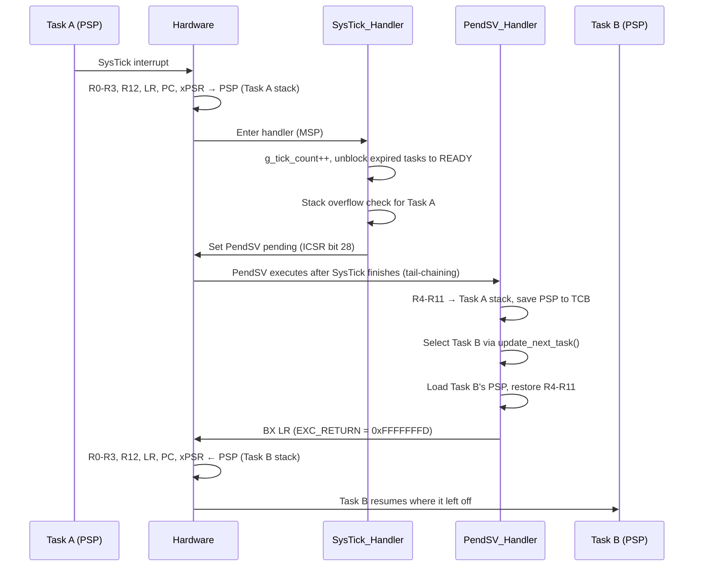

# Cortex M3 RTOS Kernel

## About the Project

An educational, minimal time-sliced (tick-based), equal-priority round-robin kernel written from scratch for ARM Cortex-M3. The kernel performs context switches between tasks using the **Round-Robin** scheduling algorithm at periods determined by the SysTick interrupt.

### Purpose

The goal is to make the internal structure of an RTOS, which generally remains a black box, transparent and to answer the following questions with code:

- How is a task created and how is its stack prepared?
- How does the processor switch from one task to another?
- When `delay` is called, how is a task put to sleep and woken up?
- How is stack overflow detected?

### Core Mechanisms

- **Task Control Block (TCB):** Holds each task's PSP value, stack limit, state, and the absolute tick at which it wakes up.
- **Context Switch:** SysTick triggers PendSV on every tick. PendSV saves registers R4-R11 and loads the next task's context.
- **Task States:** Tasks can be in the `READY` or `BLOCKED` state.
- **Idle Task:** When there are no ready tasks to run, the kernel's own idle task runs.
- **Stack Overflow Detection:** A canary value (`0xDEADBEEF`) is placed near the bottom of each task stack (`tsk_stack_addr[16]`) and checked before every context switch.

### Layered Architecture

The codebase is modularized into layers for hardware independence, allowing the kernel to be ported to different architectures:

| Layer | Folder | Responsibility |
|---|---|---|
| Application | `app/` | User tasks |
| Kernel | `middleware/` | Scheduler, TCB, delay management (largely architecture-independent, see [Design Limitations](#design-limitations)) |
| Port | `middleware/portable/arm_cm3/` | SysTick, PendSV, fault handlers (Cortex-M3 specific) |
| BSP / Drivers | `bsp/`, `drivers/` | Board startup code, linker script, LED driver |

With one exception (see [Known Issues, KI-05](docs/KNOWN-ISSUES.md#ki-05)), the kernel accesses the hardware through the `port.h` interface. The port layer does not directly know about the kernel; it receives kernel functions as **hooks (callbacks)** during `sched_init()`.

### Scope

| In Scope | Out of Scope (for now) |
|---|---|
| Round-Robin task scheduling | Task priorities |
| Context switch (SysTick + PendSV) | Mutexes, semaphores |
| Tick-based delay (`task_delay_*`) | Message queues, event groups |
| Idle task | Dynamic memory allocation for tasks |
| Stack overflow detection | Task deletion / suspension |

## Features

- Task switching with Round-Robin Scheduling Algorithm.
- Blocking tasks for specific durations using `task_delay_tick()` and `task_delay_ms()` APIs.
- Stack overflow check during context switch.

## Target Hardware

- ARM Cortex-M3, STM32F103C8T6 "Blue Pill" (8 MHz HSI, PLL not configured)
- External LEDs on GPIOA for the demo application (active-high: pin → LED → series resistor → GND)

| Pin | LED | Used by task (`app/main.c`) |
|---|---|---|
| PA0 | `LED_BLUE` | `task_led1` (500 ticks) |
| PA1 | `LED_WHITE` | `task_led2` (250 ticks) |
| PA2 | `LED_RED` | `task_led3` (1000 ticks) |
| PA3 | `LED_GREEN` | Unused (only initialized) |

The on-board PC13 LED is not used. For a known race condition in the LED driver, see [Known Issues, KI-07](docs/KNOWN-ISSUES.md#ki-07).

## Directory Structure

```
cortex-m3-rtos-kernel-educational-project/
├── app/
│   └── main.c
├── bsp/
│   └── stm32f103c8t6/
│       ├── bsp_stm32f103c8t6.h
│       ├── stm32f103c8t6_linker_script.ld
│       └── stm32f103c8t6_startup.c
├── common/
│   ├── return_enum.h
│   └── scheduler_config.h
├── docs/
│   ├── KNOWN-ISSUES-TR.md
│   └── KNOWN-ISSUES.md
├── drivers/                      
│   ├── led.c
│   └── led.h
├── middleware/                   
│   ├── portable/                 
│   │   └── arm_cm3/
│   │       ├── port_asm.s
│   │       ├── port.c
│   │       └── port.h
│   ├── scheduler.c
│   ├── scheduler.h
│   └── scheduler_priv.h
├── .gitignore
├── LICENSE
├── Makefile
├── README-TR.md
└── README.md
```

## Building and Flashing

### Requirements

- ARM GNU Toolchain (`arm-none-eabi-gcc`, `arm-none-eabi-objcopy`)
- GNU Make
- For flashing: OpenOCD and an ST-Link programmer

The linker script and startup file for STM32F103C8T6 are provided under `bsp/stm32f103c8t6/`. When porting to another board, these files must be written for that board.

### Build

```
make          # produces build/final.elf and build/final.bin
make clean    # removes the build/ directory
```

> **Important:** The Makefile does not track header dependencies. After changing a `.h` file (e.g. `scheduler_config.h`), run `make clean && make`. Otherwise object files compiled with the old values are reused (see [Known Issues, KI-11](docs/KNOWN-ISSUES.md#ki-11)).

### Flashing

```
openocd -f interface/stlink.cfg -f board/stm32f103c8_blue_pill.cfg -c "program build/final.elf verify reset exit"
```

The `make load` target currently only starts the OpenOCD server (for attaching GDB and debugging). It does not flash the board.

## Configuration

You can configure the kernel by changing the macro values in `common/scheduler_config.h` according to your application requirements. After a change, run `make clean && make` (see Build). The macros:

- `MAX_TASKS`: Total number of tasks in your program: user tasks + 1 (idle task). For 3 user tasks, it must be set to 4. **Currently, it must be exactly equal to this value.** If set higher, empty slots will be selected by the scheduler (see [Known Issues, KI-01](docs/KNOWN-ISSUES.md#ki-01)).
- `TICK_HZ`: Interrupt frequency of the SysTick timer (Hz). Default: 1000 (1 tick = 1 ms).
- `CONFIG_MAX_TICK_HZ`: Highest allowed value for `TICK_HZ`. Default: 5000. If `TICK_HZ` exceeds it, SysTick is not configured (see [Known Issues, KI-02](docs/KNOWN-ISSUES.md#ki-02)). If high frequencies are required, keep in mind that the CPU will be interrupted more often.
- `MIN_STACK_SIZE`: Minimum stack size, in words, that a task can have[^1]. Default: 64 words. The idle task's stack is fixed at 128 words in `scheduler.c` and is not affected by this macro. Therefore `MIN_STACK_SIZE` can be **at most 128**. Otherwise the idle task cannot be added and `sched_init()` returns `INVALID_PARAM`.

[^1]: The bottom 17 words of every task stack are permanently reserved: a 16-word buffer + a 1-word canary. Each time the task is preempted, its context needs 16 more words (8 by hardware + 8 by PendSV, 17 with alignment padding). The initial context frame uses this same space. So the space left for the task's own variables and function calls is about `tsk_stack_size - 33` words (64 - 33 = 31 words at the default minimum).

## Example Usage

> **Warning:** This example adds 2 tasks, so `MAX_TASKS` in `common/scheduler_config.h` must be set to **3** (2 tasks + idle). With the default value (4), an empty slot is selected and the system crashes (see [Known Issues, KI-01](docs/KNOWN-ISSUES.md#ki-01)).

```C
#include "scheduler.h"
#include "bsp_stm32f103c8t6.h"
#include "led.h" // led driver header for demo

// NOTE: requires MAX_TASKS = 3 (2 tasks + idle) in scheduler_config.h

// Define task stacks (8-byte alignment recommended by AAPCS, see sched_add_task rules)
uint32_t task_red_led_stack[128] __attribute__((aligned(8)));
uint32_t task_blue_led_stack[128] __attribute__((aligned(8)));

void task_red_led_handler(void) {

    while(1) {
        led_on(LED_RED);
        task_delay_tick(1000);
        led_off(LED_RED);
        task_delay_tick(1000);
    }
}

void task_blue_led_handler(void) {
    while(1) {
        led_on(LED_BLUE);
        task_delay_tick(500);
        led_off(LED_BLUE);
        task_delay_tick(500);
    }
}

int main(void) {
    // 1. Initialize Kernel with CPU frequency
    // The kernel does not configure the clock. Pass the CPU frequency your device actually runs at.
    init_all_leds();
    sched_init(HSI_CLOCK);

    // 2. Add Tasks
    sched_add_task(task_red_led_handler, task_red_led_stack, 128);
    sched_add_task(task_blue_led_handler, task_blue_led_stack, 128);

    // 3. Start Scheduler
    sched_start();

    return 0; // Should never reach here
}

```

## API Usage

All public APIs are defined in `middleware/scheduler.h`. This header is all you need to use the kernel API. `return_enum.h`, which defines the return codes, is included through it.

### Call Sequence

```
sched_init()  →  sched_add_task() × N  →  sched_start()
                                            │
                         from inside tasks: ├─ task_delay_tick()
                                            ├─ task_delay_ms()
                                            └─ sched_get_tick()
```

### Return Codes (`System_Status_t`)

Defined in `common/return_enum.h`:

| Code | Value | Description |
|---|---|---|
| `OK` | 0 | Operation successful |
| `ERROR_INIT` | 1 | Initialization error (currently not returned by any function) |
| `WARNING` | 2 | Warning (currently unused) |
| `ERROR_STACK_OVERFLOW` | 3 | Stack overflow detected (internal only. The system halts on overflow, so no public API ever returns it) |
| `INVALID_PARAM` | 4 | Invalid parameter |
| `REACHED_MAX_TASK` | 5 | Reached `MAX_TASKS` limit |

---

### `sched_init`

```c
System_Status_t sched_init(uint32_t clock_source);
```

Initializes the kernel. **Must be called before all other APIs.** If `sched_add_task()` is called before it, the first user task lands at index 0 and behaves like the idle task: it runs only when no other task is `READY`, and `task_delay_*` called from it does not delay.

| Parameter | Description |
|---|---|
| `clock_source` | CPU clock frequency (Hz). E.g., `HSI_CLOCK` (8 MHz) or `72000000` (only if you have configured PLL to 72 MHz yourself. The kernel does not configure the clock). Must be greater than `TICK_HZ` (see [Known Issues, KI-08](docs/KNOWN-ISSUES.md#ki-08)). |

This function performs the following steps in order:

1. Registers kernel functions as hooks in the port layer.
2. Enables UsageFault, BusFault, and MemManage faults.
3. Configures and starts SysTick to generate interrupts at the `TICK_HZ` frequency.
4. Creates the idle task (task index 0).

| Return | Condition |
|---|---|
| `OK` | Success. **Caution:** also returned when SysTick could not be configured (see [Known Issues, KI-02](docs/KNOWN-ISSUES.md#ki-02)) |
| `INVALID_PARAM` | `clock_source == 0`, or the idle task could not be added because `MIN_STACK_SIZE > 128` |
| `REACHED_MAX_TASK` | The idle task could not be added because the task table is full (e.g. `sched_init()` was called a second time, or after `sched_add_task()` calls) |

> **Note:** The idle task also consumes a task slot. For 3 user tasks, `MAX_TASKS` must be 4.
>
> **Note:** SysTick is started inside this function, so a tick can arrive before `sched_start()` (see [Known Issues, KI-03](docs/KNOWN-ISSUES.md#ki-03)).

---

### `sched_add_task`

```c
System_Status_t sched_add_task(void (*task_handler)(void),
                               uint32_t *tsk_stack_addr,
                               uint16_t tsk_stack_size);
```

Creates a new task and adds it to the scheduler in the `READY` state. Writes the canary value and the initial context frame (16 words) to the task's stack.

| Parameter | Description |
|---|---|
| `task_handler` | Task function. Must have the signature `void f(void)`. |
| `tsk_stack_addr` | The **base** address of the `uint32_t` array allocated for the task. |
| `tsk_stack_size` | Stack size in **words** (not bytes). Must be at least `MIN_STACK_SIZE`. |

| Return | Condition |
|---|---|
| `OK` | Task added |
| `INVALID_PARAM` | `task_handler` or `tsk_stack_addr` is `NULL`, or `tsk_stack_size < MIN_STACK_SIZE` |
| `REACHED_MAX_TASK` | Task table is full |

**Rules:**

- The task function **must never return**. Its body must be an infinite `while(1)` loop.
- The stack array must be `static` or global. Do not use local (function-scoped) arrays.
- It is recommended that the stack array is 8-byte aligned (AAPCS): `__attribute__((aligned(8)))`. Since the task starts at the top of its stack (`tsk_stack_addr + tsk_stack_size`), `tsk_stack_size` must also be an even number. The kernel neither checks nor fixes alignment (see [Known Issues, KI-06](docs/KNOWN-ISSUES.md#ki-06)).
- Must not be called before `sched_init()` (see `sched_init`).
- Tasks should not be added after calling `sched_start()`.

```c
static uint32_t stack_task_led[128] __attribute__((aligned(8)));

if (sched_add_task(&task_led, &stack_task_led[0], 128) != OK)
{
    // error handling
}
```

---

### `sched_start`

```c
void sched_start(void);
```

Starts the scheduler. **Does not return.**

Switches Thread mode stack pointer from MSP to PSP and executes the idle task first. The idle task is started by a **direct function call**, not by an exception return, so its mock context frame is never used. On the first SysTick interrupt, a context switch occurs, and user tasks in the `READY` state start executing sequentially.

MSP stays at the depth used by `main()` and `sched_start()`; it is not reset to `_estack`.

---

### `task_delay_tick`

```c
void task_delay_tick(uint32_t tick_count);
```

Puts the calling task into the `BLOCKED` state and immediately switches to another task. The delay is between n-1 and n ticks (shortened if called mid-tick). Time spent waiting for its turn in the round-robin order may be added to this. When the duration elapses, the SysTick handler sets the task back to `READY`.

| Parameter | Description |
|---|---|
| `tick_count` | Number of ticks to wait. 1 tick = `1 / TICK_HZ` seconds. |

- **Must only be called from within a task.** If called from the idle task or before `sched_start()`, it does not delay, but enables interrupts.
- **Must not be called from an interrupt handler (ISR).** If it is, it blocks whichever task was interrupted and enables interrupts in the middle of the ISR.
- Passing `tick_count = 0` causes the task to yield the CPU until the next tick.
- Very large `tick_count` values, or calls made close to tick counter rollover, can end the delay early (see [Known Issues, KI-04](docs/KNOWN-ISSUES.md#ki-04)).
- The function disables and re-enables interrupts for the critical section. Interrupts are **always** enabled upon exit.

```c
task_delay_tick(500);   // 500 ms if TICK_HZ = 1000
```

---

### `task_delay_ms`

```c
void task_delay_ms(uint32_t ms);
```

Specifies delay in milliseconds. Internally converts to ticks and calls `task_delay_tick()`:

```c
tick = (ms * TICK_HZ) / 1000
```

- The result is **rounded down** using integer division. E.g., when `TICK_HZ = 100`, `task_delay_ms(5)` → 0 ticks.
- For very large `ms` values, the `ms * TICK_HZ` product can overflow (for `TICK_HZ = 1000`, above ~4,294,967 ms ≈ 71 minutes).

```c
task_delay_ms(250);
```

---

### `sched_get_tick`

```c
uint32_t sched_get_tick(void);
```

Returns the total number of ticks elapsed since kernel initialization. Can be used for time measurement:

```c
uint32_t start = sched_get_tick();
/* ... work ... */
uint32_t elapsed_ticks = sched_get_tick() - start;
```

> **Note:** The counter is 32-bit. When `TICK_HZ = 1000`, it overflows and rolls over to zero in approximately **49.7 days**. If unsigned subtraction is used as shown above, the measurement is unaffected by overflow.

---

### `init_idle_task` (internal)

```c
System_Status_t init_idle_task(void);
```

Although visible in `scheduler.h`, it **must not be called by the user**. `sched_init()` already calls this function. Calling it again adds a second idle task as a normal task into the table, wasting a task slot and CPU time.

## Architecture and Working Principle

### Task Structure (TCB)

Each task is represented by a **Task Control Block** defined in `middleware/scheduler_priv.h`:

```c
typedef struct
{
  uintptr_t psp_value;          // Task's last saved stack pointer (PSP)
  uint32_t *stack_limit;        // Canary address (safe lower limit of the stack)
  uint32_t  block_count;        // Absolute tick count when the task will wake up
  uint8_t   current_state;      // TASK_READY_STATE (0x00) / TASK_BLOCKED_STATE (0xFF)
  void    (*task_handler)(void);// Task function
} TCB_t;
```

TCBs are stored in a static array: `static TCB_t user_tasks[MAX_TASKS]`. No dynamic memory allocation is used.

- **Index 0** always belongs to the idle task (added inside `sched_init()`).
- **Indices 1 … `MAX_TASKS-1`** are user tasks, filled in the order of `sched_add_task()` calls.
- `current_task` holds the index of the currently running task.

#### Initial State of the Task Stack

`sched_add_task()` constructs a mock context frame as if the task had been interrupted before, even though it hasn't run yet. This allows the first context switch of user tasks to follow the exact same path as subsequent ones. The idle task is the exception: `sched_start()` calls it directly, so its mock frame is never used.

```
high address  ┌────────────────────┐ ← tsk_stack_addr + tsk_stack_size
              │ xPSR = 0x01000000  │  Thumb bit (T=1). Cortex-M only executes Thumb.
              │ PC   = task_handler│  Execution begins here upon exception return.
              │ LR   = 0xFFFFFFFD  │  If task returns, branches to invalid address → fault.
              │ R12, R3, R2, R1, R0│  = 0         ┐ 8 words automatically
              ├────────────────────┤               ┘ saved by hardware
              │ R11 … R4           │  = 0         ← 8 words saved in software by PendSV
              ├────────────────────┤ ← psp_value (initial value)
              │   (free area)      │  task's own usage
              │ 0xDEADBEEF         │ ← stack_limit = tsk_stack_addr[16]
              │ 16-word buffer     │
low address   └────────────────────┘ ← tsk_stack_addr
```

### Context Switch (SysTick / PendSV / PSP)

Cortex-M3 has two stack pointers:

| Stack Pointer | Used By |
|---|---|
| **MSP** (Main SP) | `main()` after reset, all interrupt and exception handlers |
| **PSP** (Process SP) | All tasks after `sched_start()` (each task maintains its own PSP value) |

`switch_sp_to_psp` in `sched_start()` sets PSP to the idle task's stack and sets bit 1 of the `CONTROL` register. From that point on, Thread mode uses PSP while handlers continue to use MSP. Consequently, the handlers' own variables and function calls do not consume task stacks. However, when a task is interrupted, the 8-word frame saved automatically by hardware (9 with alignment padding) is written **to the task's own stack (PSP)**. Every task stack must leave room for it.

The context switch occurs in two phases:



**Why is the switch performed in PendSV rather than directly inside SysTick?** A context switch request can originate from multiple places: SysTick, `task_delay_tick()`, or other interrupts in the future. If a switch is performed while another interrupt is in progress, that interrupt's context is corrupted. PendSV is an exception designed for "pend now, execute when convenient." When configured to the lowest priority, it is guaranteed to execute after all other active handlers have completed. Therefore, both paths pend PendSV via the same `port_trigger_context_switch()` function, and the switch is handled in a single unified location.

### Task Selection (Round-Robin)

`update_next_task()` cyclically scans the table starting from `current_task`:

```c
for (i = 0; i < MAX_TASKS; i++)
{
    current_task = (current_task + 1) % MAX_TASKS;
    if (state == READY && current_task != 0) break;   // first READY task other than idle
}
if (not found) current_task = 0;                      // idle if none are ready
```

- Time slice is **1 tick**. On every SysTick, execution moves to the next READY task.
- The idle task is selected only if **no user task is READY**.
- There is no concept of priority; all READY tasks receive an equal share of CPU time.

Example (`main.c`, `TICK_HZ = 1000`). Because tasks toggle an LED and immediately call delay, they yield to the next task without waiting for a tick:

```
tick 0       : idle  (sched_start)
tick 1       : L1 → delay(500) → L2 → delay(250) → L3 → delay(1000) → idle
tick 2..250  : idle  (all tasks BLOCKED)
tick 251     : L2 wakes up → delay(250) → idle
tick 501     : L1 and L2 wake up → L1 → L2 → idle
...
```

### Scheduling and Delay

The delay mechanism is based on an **absolute wake-up time**:

1. A task calls `task_delay_tick(n)`.
2. Interrupts are disabled. `block_count = g_tick_count + n` is written to the TCB and the task is set to `BLOCKED`.
3. `schedule()` performs an overflow check and pends PendSV.
4. When interrupts are enabled, PendSV executes immediately and the task yields the CPU.
5. In each SysTick, `unblock_tasks()` sets tasks with `block_count <= g_tick_count` back to `READY`.
6. When the task's turn arrives in Round-Robin, it resumes execution as if returning from `task_delay_tick()`.

> A task may not run immediately on the exact tick it becomes `READY`. If other READY tasks precede it in the round-robin order, it waits for its turn. The delay is between n-1 and n ticks (shortened if called mid-tick). Time spent waiting for its turn in the round-robin order may be added to this.

### Stack Overflow Check

The check is implemented in software. `check_task_stack_overflow()` evaluates two conditions:

| Condition | Meaning |
|---|---|
| `*stack_limit != 0xDEADBEEF` | Canary has been overwritten, stack overflowed |
| `stack_limit > psp_value` | PSP saved in the TCB has dropped below the safe threshold |

The check is performed in two places, always for the **currently running task**:

- Inside `SysTick_Handler`, before pending PendSV.
- Inside `schedule()`, when `task_delay_tick()` is called.

> **Note:** `psp_value` is not updated while the task is running. Because the check runs before PendSV saves the new PSP, the second condition looks at the PSP from the task's **previous** context switch. Detection through this condition is therefore one round late. The canary condition is the one that reflects the state at the time of the check.

If an overflow is detected, `UsageFault_Handler` is invoked and the system halts. This is not a real fault, but an ordinary function call (`BL`). Consequences:

- `LR` holds the `BL` return address, not an EXC_RETURN value. The handler's `TST LR, #4` test picks MSP/PSP arbitrarily, so `pBaseStackFrame` is not reliable.
- No fault bit is set in CFSR. If the debugger stops in `UsageFault_Handler_c` and CFSR is empty, the cause is most likely a stack overflow detection.
- Since the handler never returns, the `ERROR_STACK_OVERFLOW` return paths in `schedule()` and `SysTick_Handler` never execute.

The 16-word buffer below the canary prevents hardware-pushed context frames from corrupting adjacent memory prior to detection.

### Fault Management

`sched_init()` → `port_init()` → `init_processor_faults()` enables the following faults in the `SHCSR` register:

| Bit | Fault | Typical Cause |
|---|---|---|
| 16 | MemManage | MPU violation, executing code from an XN region |
| 17 | BusFault | Invalid memory address access |
| 18 | UsageFault | Undefined instruction, non-Thumb state, unaligned access with LDM/STM/LDRD/STRD[^2] |

[^2]: Since the `CCR.UNALIGN_TRP` bit is not enabled, unaligned accesses with normal `LDR`/`STR` instructions do not fault. Likewise, since `CCR.DIV_0_TRP` is not enabled, division by zero does not fault either.

If these faults are not enabled, they escalate into HardFault, making the root cause difficult to diagnose.

Each fault handler first determines in assembly (`port_asm.s`) which stack was active at the time of the fault:

```asm
TST   LR, #4        ; EXC_RETURN bit 2: 0 = MSP, 1 = PSP
ITE   EQ
MRSEQ R0, MSP
MRSNE R0, PSP
B     xxx_Handler_c ; R0 = address of the hardware-saved stack frame
```

Then the C handler (`port.c`) enters an infinite loop. Using a debugger, inspect `pBaseStackFrame` to find where the fault occurred:

| Index | Register |
|---|---|
| `pBaseStackFrame[0..3]` | R0-R3 |
| `pBaseStackFrame[4]` | R12 |
| `pBaseStackFrame[5]` | LR (LR at the time of the fault, usually the return address into the caller of the faulting function) |
| `pBaseStackFrame[6]` | **PC** (address of the instruction that caused the fault. Not exact for an imprecise BusFault) |
| `pBaseStackFrame[7]` | xPSR |

## Design Limitations

The following items are deliberate design choices and the limits of the current scope. Known bugs in the code are tracked in a separate file: [docs/KNOWN-ISSUES.md](docs/KNOWN-ISSUES.md).

- **The kernel is not fully architecture-independent.** When porting to another architecture, the following inside `middleware/` must also change:
  - `sched_add_task()` builds the initial stack using the Cortex-M exception frame layout (xPSR, PC, LR, R12, R0-R3, R4-R11) and the `DUMMY_XPSR` / `DUMMY_LR` values directly.
  - `MIN_STACK_FRAME_SIZE` (16 words) is chosen for the Cortex-M context size. The canary and the `stack_limit > psp_value` check assume a downward-growing stack.
  - `sched_start()` uses `switch_sp_to_psp()`, which relies on the MSP/PSP split.
  - The ARM-specific call in `check_task_stack_overflow()` (see [Known Issues, KI-05](docs/KNOWN-ISSUES.md#ki-05)).
- **PendSV priority is not configured.** Standard practice is to set PendSV to the lowest exception priority. Currently, all exceptions run at the default priority (0). When additional interrupts are introduced, this must be properly configured.
- **Context switch occurs on every tick.** Even if there is only one READY task, PendSV triggers and the task switches to itself.
- **Critical sections do not support nesting.** `interrupt_enable()` unconditionally clears `PRIMASK` without checking its previous state. Calling `task_delay_tick()` while interrupts are disabled will re-enable interrupts upon exit.
- **Overflow detection is reactive.** A corrupted canary is only detected on the next tick or delay call, and the PSP condition one round later. Writes that skip over the canary (e.g., large local arrays) may go unnoticed. No hardware memory protection (MPU) is utilized.
- **Fault handlers only halt.** There is no recovery mechanism such as error logging, terminating the faulty task, or restarting the system.
- **All tasks run in privileged mode.** Tasks have access to system registers. There is no memory isolation between tasks.
- **Idle task spins in a busy loop.** It does not use `WFI` to enter sleep mode, so no power saving is achieved.
- **`task_delay_ms()` precision.** Uses integer division which rounds down. For very large values, `ms * TICK_HZ` can overflow.
- **Static architecture.** Task count is fixed at compile time. Task deletion, suspension, and priorities are not supported.

## License

This project is licensed under the MIT License. See the LICENSE file for details.

Last synced with README-TR.md: 2026-10-07

